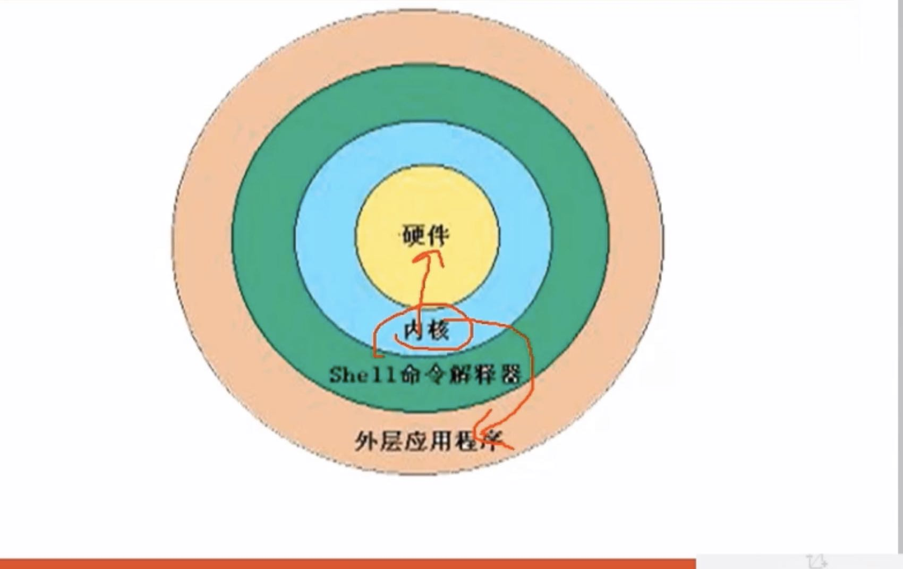

# Linux的学习框架

## 练习的重要性

操作系统（数据库管理系统也一样）是一个操作性非常强的系统，想要真正掌握Linux/Unix操作系统，就必须不断使用它

**现实生活中也一样，当人们没有真正地见到或体验到某一事物时，是很难理解它的。**例如对月亮的理解，我们的祖先费尽心机经过了不知道多少代精英的毕生努力才研究出嫦娥奔月、广寒宫、玉兔和天蓬元帅等与月球相关的理论，但现代科学证明这些只能是美好的传说而已。

在学习Linux操作系统的时，不要只是看书听课，这是最简单的，一定要反复的实践。

只有不断地实践，才能保证在正确的道路上前行。


## UNIX和Linux概述

UNIX是用来   协调、管理和控制     计算机硬件和软件资源    的    控制程序

> 操作系统也是一个程序

**UNIX系统是一个多用户和多任务操作系统**

多用户表示在同一时刻可以有多个用户同时使用UNIX操作系统而且他们互不干扰；

多任务表示任何用户在同一时间可以在UNIX操作系统上运行多个程序

### UNIX的设计理念

UNIX操作系统所秉持的设计理念的宗旨就是 简单、通用和开放

1. **在UNIX系统中所有的东西都是文件，其中也包括了硬件**

UNIX系统的文件系统采用树状层次结构，它像一颗倒置的树，其中`\`是根目录，以下的节点既可以是目录也可以是文件。UNIX的目录相当于Windows中的文件夹

2. 所有的操纵系统配置数据都储存在正文文件中。
3. 每一个操作系统命令或应用程序都很小，而且只完成单一的功能
4. 避免使用俘获用户的接口
5. 可以将多个程序串接在一起来完成复杂的任务

### Linux简介




Linux操作系统是一个模块化的系统。

在系统的底层，是由内核(Kernel)与硬件(Hardware)进行交互，同时内核也代表应用程序控制和调度所访问的资源（这些资源包括CPU，内存，储存设备，网络等）

应用程序是运行在所谓的用户空间(User Space) 中而只能通过调用一组稳定的系统程序库来请求内核的服务。

这种模块化的设计允许Linux的一些组件源自不同的开发人员，而每一个组件都有开发人员自己心目中特殊的设计目标。模块化的设计还意味着Linux的内核是独立于任何应用程序和界面的。这带来的好处是：当应用程序崩溃时或应用程序中出现安全漏洞时一般会只孤立在应用程序中，而不会蔓延至整个系统。

在Linux系统中，每一个组件都是独立配置的，而且基本上是通过基于正文的配置文件来配置的。这些系统配置并不是储存在一个加密的数据库中，如Windows系统的注册表。可以通过脚本文件或简单的正文编辑器读写配置信息。在访问系统配置信息时并不需要（也没有）特殊的应用程序接口(API)。


### Linux命令的格式

Linux命令的语法并不复杂

```
命令 [选项] [参数] 
command [options] [arguments]
```

在命令行中，命令相当于英语的动词，选项相当于英语的形容词，参数相当于英语的名词，而整个命令就相当于英语的语句。

